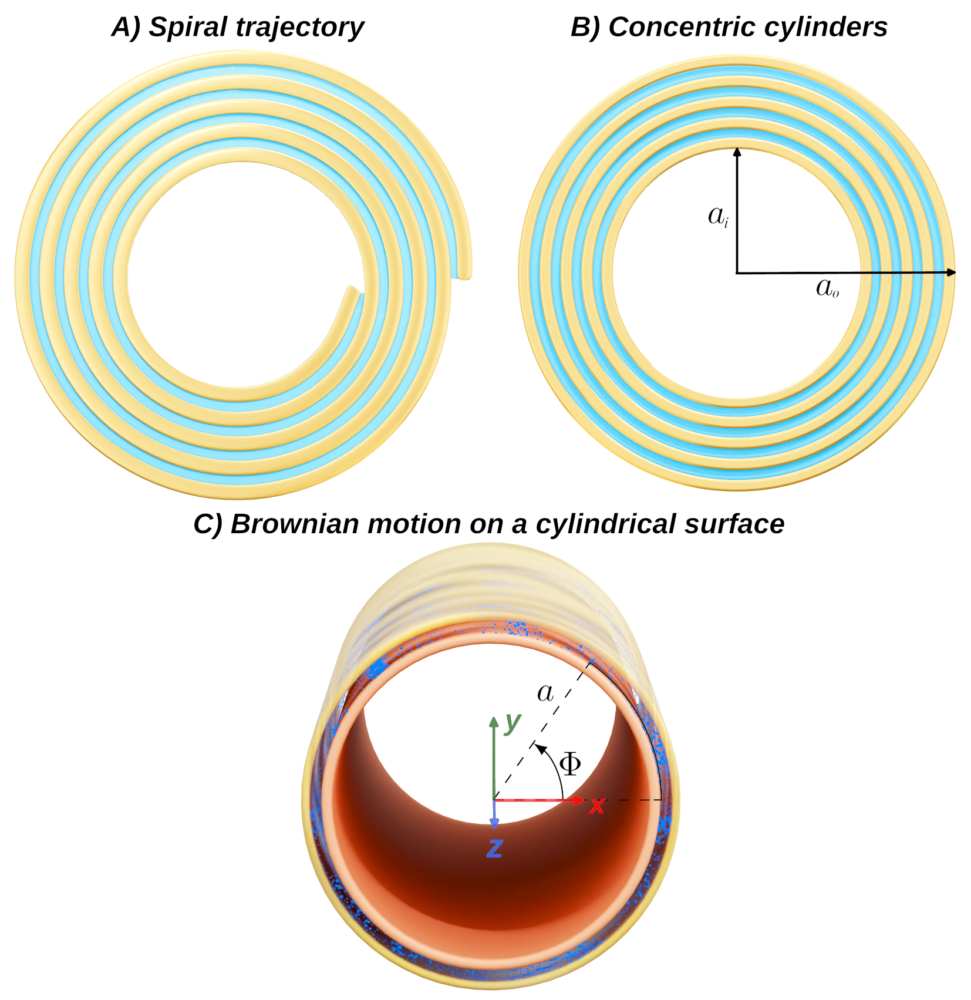

# Myelin Water Diffusion MRI Models



📢 This repository contains the models, synthetic data, and scripts described in our manuscript (under revision in *Frontiers in Physics*, 2025):  
**"A Diffusion MRI Model for Random Walks Confined on Cylindrical Surfaces: Towards Non-Invasive Quantification of Myelin Sheath Radius"**  
*Erick J. Canales-Rodríguez, Chantal M.W. Tax, Elda Fischi-Gomez, Derek K. Jones, Jean-Philippe Thiran, Jonathan Rafael-Patiño*

---

## Summary

Quantifying the myelin sheath radius of myelinated axons *in vivo* is critical for understanding, diagnosing, and monitoring various neurological disorders. Despite advancements in diffusion MRI (dMRI) microstructure techniques, models specifically designed to estimate myelin sheath radii have remained unavailable.  

This proof-of-concept study introduces two novel dMRI models that characterize the dMRI signal from water diffusion confined to cylindrical surfaces, approximating myelin water diffusion. Key contributions include:  

1. **Derivation of spherical mean signals**, eliminating fiber orientation and dispersion effects.  
2. **Extension of the models to multiple concentric cylinders**, mimicking the layered structure of myelin.  
3. **A method to convert histological distributions of axonal inner radii** into myelin sheath radius distributions.  
4. **Analytical expressions** to estimate effective myelin sheath radii.  

Monte Carlo simulations in cylindrical and spiral geometries validate the models, demonstrating agreement with analytical predictions. Simulations also reveal strong correlations between effective radii derived from histological distributions and those obtained by fitting the dMRI signal to a single-cylinder model.  

---

## Repository Structure 📖

- **`Data/`**  
  Includes synthetic datasets used for validation. To access the datasets, unzip the provided `Data.zip` file:  
  ```bash
  unzip Data.zip -d Data/
  
## Main Directory and Usage 🚀
It contains additional Python and Matlab scripts to reproduce the figures and analyses presented in the manuscript. For example:

    python run_Fig3_Spherical_mean_signal_diffraction_peaks_for_paper.py
    

## Getting Started - dependencies 🔧
Before running the scripts, ensure the following requirements are met:
```
Python 3.8+
-numpy
-matplotlib
-scipy
-dipy
```
## Installation 🎁
Clone the repository and navigate to its directory:

    git clone https://github.com/username/myelin-water-diffusion-models.git
    cd myelin-water-diffusion-models

## Citation ✒️
If you use this repository in your research, please cite the manuscript once published:

Canales-Rodríguez EJ, Tax CMW, Fischi-Gomez E, Jones DK, Thiran J-P, Rafael-Patiño J.
A diffusion MRI model for random walks confined on cylindrical surfaces: Towards non-invasive quantification of myelin sheath radius.
Frontiers in Physics (2025, to be updated).
Available at: https://arxiv.org/abs/2410.18842

## License 📄
This project is licensed under the CC BY public copyright license.

## Contact 📧
For questions or suggestions, please contact: Erick J. Canales-Rodríguez

    Emails: ejcanalesr@gmail.com, erick.canalesrodriguez@epfl.ch
